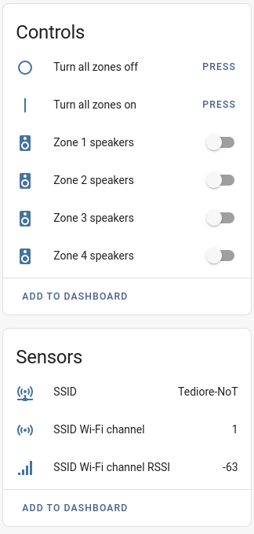

# Audioflow to MQTT Gateway

This is the Home Assistant add-on version of [audioflow2mqtt](https://github.com/Tediore/audioflow2mqtt-addon). audioflow2mqtt enables local control of your Audioflow speaker switch(es) via MQTT. It supports Home Assistant MQTT discovery for easy integration.

 

# Configuration

| Variable | Default | Description |
|----------|---------|-------------|
| MQTT host | core-mosquitto | IP address or hostname of the MQTT broker to connect to. |
| MQTT port | 1883 | The port the MQTT broker is bound to. |
| MQTT username | None | The user to send to the MQTT broker. |
| MQTT password | None | The password to send to the MQTT broker. |
| MQTT base topic | audioflow2mqtt | The topic prefix to use for all payloads. |
| Devices | None | IP address(es) or hostname(s) of your Audioflow device(s). |
| Log level | info | Minimum log level. |

 

# Home Assistant
audioflow2mqtt supports Home Assistant MQTT discovery which creates a Device for the Audioflow switch with the following:
- Switch entities for each zone
- Button entities to turn all zones on/off
- Sensors for SSID, RSSI (signal strength), and Wi-Fi channel

 

# MQTT topic structure and examples
The command topic syntax is `BASE_TOPIC/serial_number/command/zone_number` where `BASE_TOPIC` is the base topic you define, `serial_number` is the device serial number (found on the sticker on the bottom of the device), `command` is one of the below commands, and `zone_number` is the zone you want to control (zone A on the switch is zone number 1, zone B is zone number 2, and so on).

Valid commands are `set_zone_state` and `set_zone_enable`. The examples below assume the base topic is the default (`audioflow2mqtt`) and the serial number is `0123456789`.

**Turn zone B (zone number 2) on or off, or toggle between states**

Topic: `audioflow2mqtt/0123456789/set_zone_state/2`

Valid payloads: `on`, `off`, `toggle`

**Turn all zones on or off**

Topic: `audioflow2mqtt/0123456789/set_zone_state` (note the lack of a zone number at the end of the topic)

Valid payloads: `on`, `off`

**Enable or disable zone A (zone number 1)**
_This might not really be something you would need, but I figured I'd add it anyway_

Topic: `audioflow2mqtt/0123456789/set_zone_enable/1`

Valid payloads: `1` for enabled, `0` for disabled

 

When the zone state or enabled/disabled status is changed, audioflow2mqtt publishes the result to the following topics:

**Zone state:** `audioflow2mqtt/0123456789/zone_state/ZONE`

**Zone enabled/disabled:** `audioflow2mqtt/0123456789/zone_enabled/ZONE`

 

Network info is published to the following topics:

**SSID:** `audioflow2mqtt/0123456789/network_info/ssid`

**Wi-fi channel:** `audioflow2mqtt/0123456789/network_info/channel`

**RSSI:** `audioflow2mqtt/0123456789/network_info/rssi`

 

